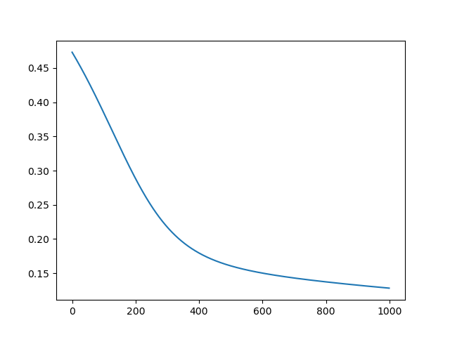

# Ohdized

---

_**Ohdized** -> Expressive form of ODZ_
<br>_**ODZ** -> Short form of **One Divided by Zero**_

> Mathematics has a habit of introducing something new in senior classes just 
> when we think we have mastered our syllabus and are the kings of arithmetic. 
> Our new teachers in the next class start with a foreign topic as if it's no 
> big deal! 
> 
> Do you doubt me? What about imaginary numbers? They're numbers that, when 
> squared, result in a negative value, like negative one! And fractals? Once 
> seen as unexplored realms, often labeled as chaos, they have now become a 
> vast intersection between mathematics and art! Yet, these facts might seem 
> unnecessary if we reflect on the necessity of inventing zero in the first place.

## Zeta Numbers

I am spinning up a new term randomly, since _imaginary_ is already taken.

> A zeta number is a real number multiplied by the zeta unit z, which is defined by its property 0 * z = 1.

Let's just dive into some examples:

Say, a and b are two numbers as:

`a = 14 + 10z`
`b = 12 + 20z + 6z²`

Then,

```
Usual things
a + 20 -> 34 + 30z
a * 20 -> 280 + 200z

Unusual things
a ** 2 -> 196 + 280z + 100z²
a * 0 = 10
a / 0 = 0 + 14z + 10z²

Binary Things
a + b = 26 + 30z + 6z²
a - b = 2 - 10z - 6z²
a * b = 168 + 400z + 284z² + 60z³
```

Also tried using a simple perceptron whose weights were initialised using zeta numbers.
Following is the training loss curve
